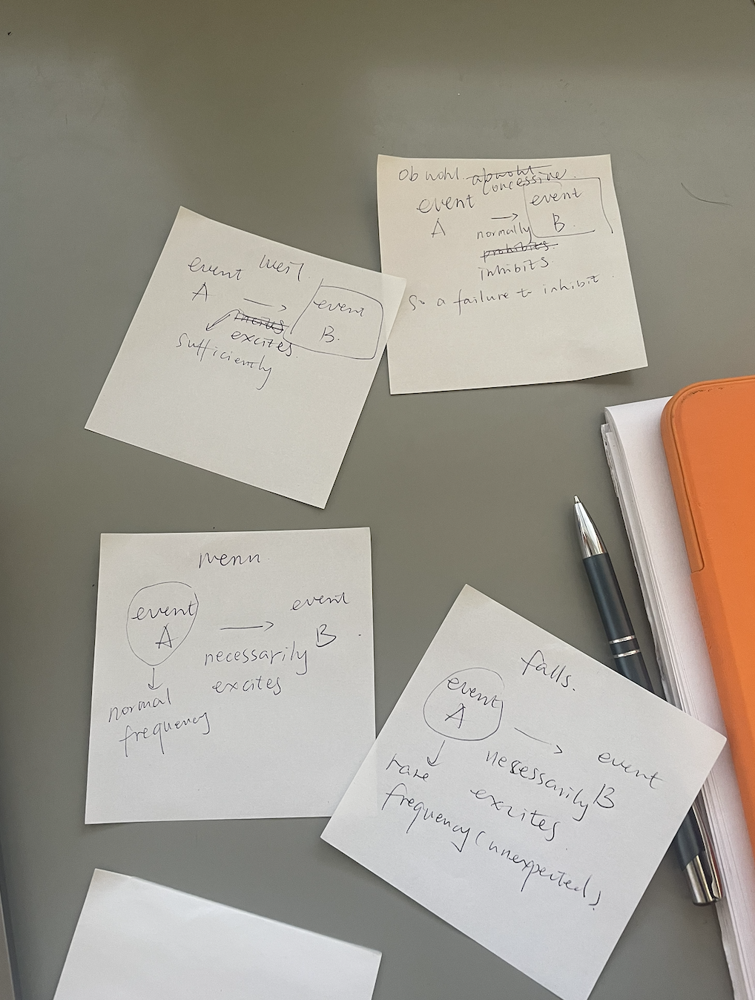

I was learning several German conjunctions, and wanted to figure out what they mean exactly. They share some behaviors with logical operators, so I did a couple sketches with the neuron model. 

(1) Obwohl (although)

Consider two events A and B. The firing of A normally inhibits that of B, but in the case in question, A and B both fires. It’s called concessive conjunction. Conceding is an action of admition after resistance, and in analogy with this case, event A is supposed to resist event B, but in reality they both happens. Event A concedes. 

(2) weil (because)

In this case event A sufficiently excites event B. We know that event B happens, and look back in time for the culprit that somehow facilitated it. 

(3) wenn (if)

Event A necessarily excites the firing of event B. What we know about event A is that it is an ordinary event, and we have an average expectation of its firing. Both events are in the future so we don’t know their condition yet. This fact is to be contrasted with the following one. 

(4) falls (in case of)

This one has the same logical route as the previous one, that event A necessarily excites the firing of B. But here we have a pretty low expectation of the firing of A before it fires. As the previous one, both these two also haven’t happened. 