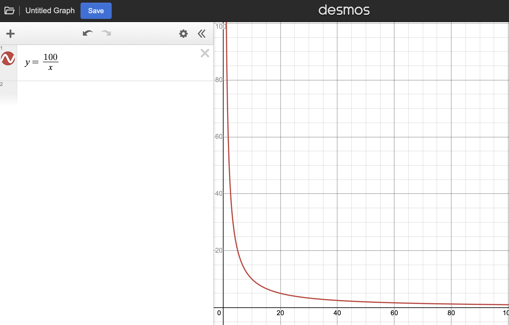
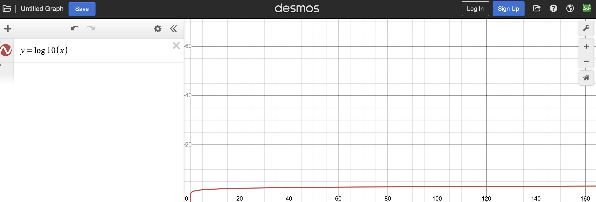

$$TF-IDF$$ is an easy-to-use measurement for word importance in a range of documents. The formula is straightforward, but there are a few basic ideas that are transferable to other problem-solving processes. 

Simply put, $$TF-IDF$$ is a product of two numbers, each measuring a scope of importance. The first deals with local importance while the second global. The formula looks like this: 

$$
TF=\frac{\text{word count}}{\text{words count}}
$$

$$
IDF=log_{10}(\frac{\text{count of all documents}}{1+\text{count of all documents with word}})
$$

$$
TF-IDF=TF*IDF
$$

$$TF$$ is a standard frequency formula, but $$IDF$$ uses a bunch of tricks to satisfy the purpose. First of all, it deploys the reciprocal of part/whole fraction to oppose the fraction’s behavior. Namely, the reciprocal inverses the fraction’s growth: when part is big, fraction is big too. 

Secondly, it uses a log function to pacify the global importance. This concerns the behavior of the function $$
y=a/x (0<=x<a)
$$. When x is very small (high global importance), the whole/part gets very big (graph 1), so a log function takes in the very big number and limits its growth, so that it is still manageable (graph 2), we only care about when $$x>=0$$. 

Thirdly, the final $$TF-IDF$$ methods takes the two numbers and multiplies them, instead of adding them, because multiplication correlates with the logical operator “and”, meaning the product only gets large when both are large. If one of them is small, the product is still small. Multiplication guarantees a big number entails both situations happen simultaneously. 

Finally, probably a trivial one, adding one to the denominator of the argument in the log function avoids it being undefined. 
